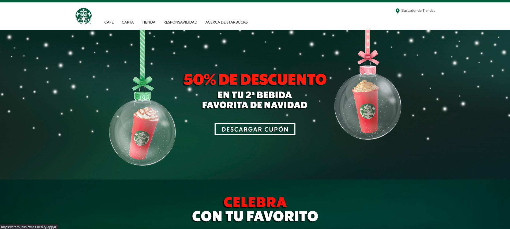

## Link. 🔗

[](https://app.netlify.com/sites/starbucks-xmas/deploys)

[Starbucks Christmas Web Site.](https://starbucks-xmas.netlify.app/)

# Starbucks Xmas Home Page. 🎄

This is a simple copy of the Starbucks Christmas home page. Using Css Flex-box and Css Grid.

- To get started:

## Clone the repository

```bash
git https://github.com/RenszCamacho/starbuks-xmast
cd starbuks-xmast
```

## Install the dependencies

```bash
#Using npm
npm install

#Using yarn
yarn
```

## Run it live

```bash
#Build dev
npm run dev or yarn dev

#Build for Production
npm run build or yarn build
```

This is deployed on Netlify.

## Tools. ⚒️

- HTML5.
- CSS3.
- ParcelJs(Bundler).
- Sass(Css Pre-precesor).
- Methodology/BEM(Css Especificity).
- Git and Github.
